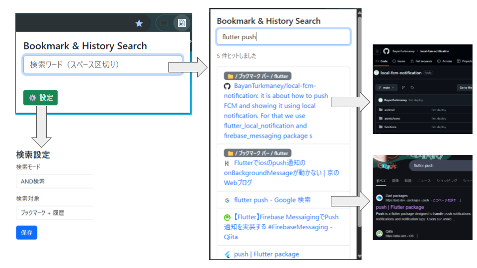

# Tadorun

Tadorun is a Chrome extension for searching bookmarks, browsing history, and recently closed tabs from one popup.

Tadorun は、ブックマーク、閲覧履歴、最近閉じたタブを 1 つのポップアップから検索できる Google Chrome 拡張です。

[Chrome Web Store](https://chromewebstore.google.com/detail/fjlafgfjokeemphjaeapcmfmcicehahi?utm_source=item-share-cb)

## English

### Features
- Search bookmarks, browsing history, and recently closed tabs together.
- Use `site:`, `title:`, and `url:` operators.
- Save frequently used searches and reopen them quickly.
- Switch result tabs with keyboard navigation.
- Filter results by domain and bookmark folder.
- Edit, delete, copy, and open results directly from the popup.
- Switch UI language between Japanese, English, French, Spanish, German, Italian, Portuguese (Brazil), Chinese, and Korean.

### Search examples
- `site:github.com release notes`
- `title:design system`
- `url:docs -site:example.com`

### Shortcuts in the popup
- `Arrow Up / Arrow Down`: move through results
- `Enter`: open the selected result
- `Ctrl/Cmd + S`: save the current search
- `Ctrl/Cmd + Shift + S`: open saved searches
- `Tab / Shift + Tab`: switch result tabs

## 日本語

### 主な機能
- ブックマーク、閲覧履歴、最近閉じたタブをまとめて検索できます。
- `site:` `title:` `url:` の検索演算子に対応しています。
- よく使う検索条件を保存してすぐ再利用できます。
- キーボードで結果移動やタブ切替ができます。
- ドメインやブックマークフォルダで絞り込みできます。
- ポップアップ上で URL コピー、ブックマーク編集、削除、タブで開く操作ができます。
- UI 言語は日本語、英語、フランス語、スペイン語、ドイツ語、イタリア語、ポルトガル語（ブラジル）、中国語、韓国語に対応しています。

### 検索例
- `site:github.com release notes`
- `title:design system`
- `url:docs -site:example.com`

### ポップアップ内ショートカット
- `Arrow Up / Arrow Down`: 結果を移動
- `Enter`: 選択中の結果を開く
- `Ctrl/Cmd + S`: 現在の検索を保存
- `Ctrl/Cmd + Shift + S`: 保存済み検索を開く
- `Tab / Shift + Tab`: 結果タブを切り替え